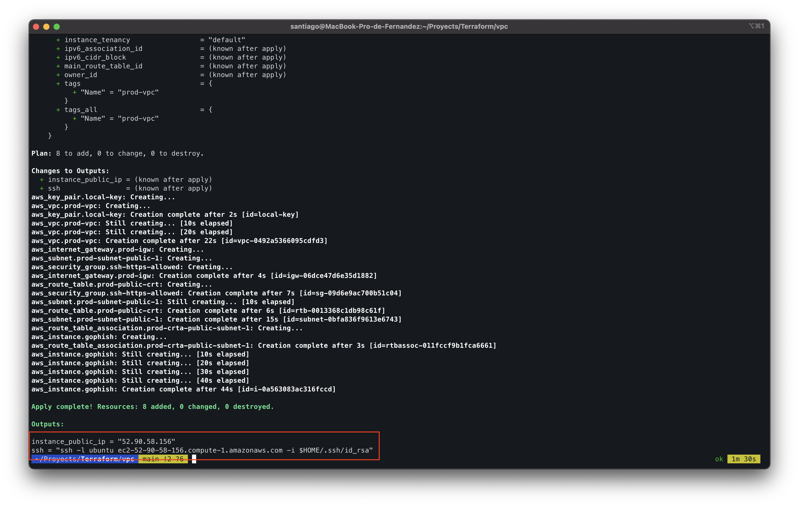

## Terraform VPC & EC2 

To create the a VPN in AWS to run GoPhish as a Service. 

It will be necessary to have:

:one: [Terraform](https://learn.hashicorp.com/tutorials/terraform/install-cli) installed

:two: [AWS programmatic credeials](https://docs.aws.amazon.com/general/latest/gr/aws-sec-cred-types.html)

:three: Your own Domain in Cloudflare

#### Create the Host A 

[Follow this Tutorial](https://www.tech-otaku.com/web-development/using-cloudflare-api-manage-dns-records/#413)

You must save ZONE ID & ID to use in next steps.

### Clone the proyect
````
git clone https://github.com/safernandez666/Terraform.git && cd Terraform
cd vpc

````
### Configure 

You must change the variables on **install.sh** with this variables

```
API_EMAIL="XXXX"
API_KEY="XXXX"
RECORD_NAME="netflix.XXXX.XXX.XX"
ZONE_ID="XXXX"
RECORD_ID="XXXX"
```

### Prepare de VPC with the server````
```
terraform init
terraform plan
terraform apply 
````

Check the Output. You will have the address to connect by ssh to the instance. Then it will be necessary to know the default password of GoPhish.

<p align="center">

</p>

Search the default password on Syslog

```
grep -n "Please login with the username admin and the password" /var/log/syslog
```

Ready to login on **https://YOURDOMAIN:3333**

Now you have the GoPhish platform to use. 